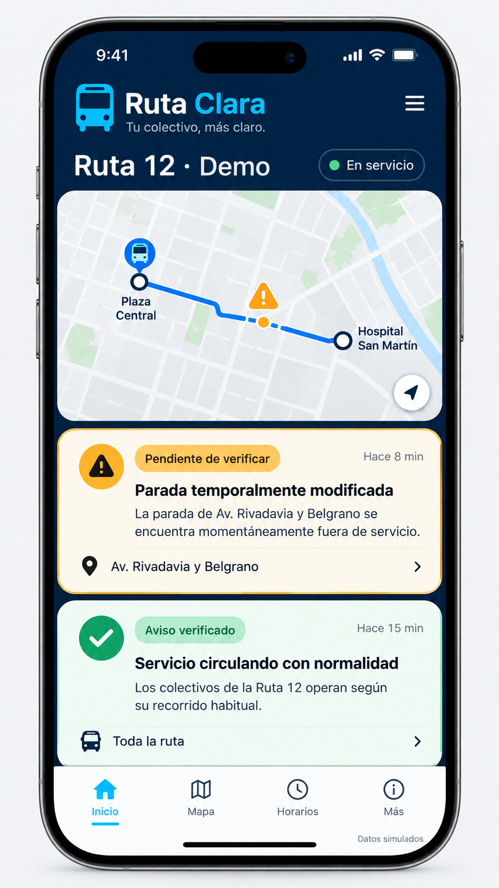
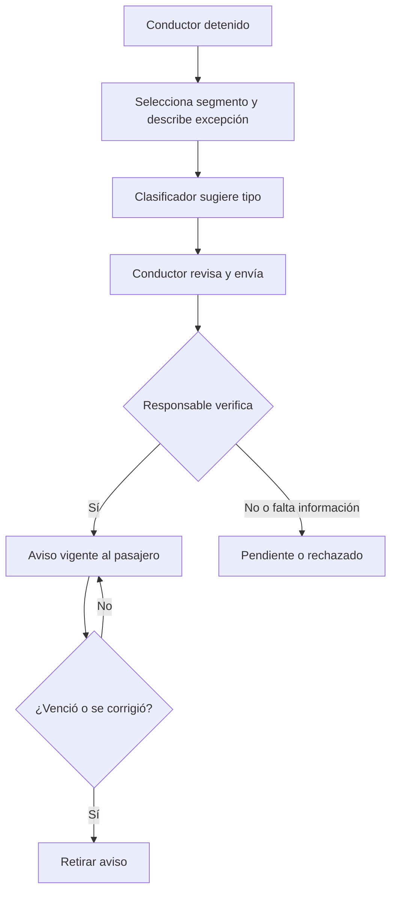
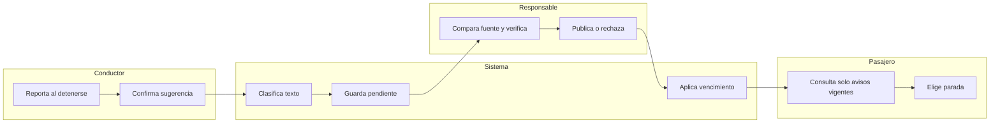

# PACKET — Ruta Clara / Week 7
Fernanda Espinosa · 27 septiembre 2026 · **Creado antes del código**

## Problema y usuario
En un colectivo informal, un cambio temporal de parada puede existir en la experiencia del conductor sin llegar a tiempo al pasajero. El usuario exacto es una conductora voluntaria detenida que reporta un cambio de parada de una ruta piloto ficticia, una responsable de la asociación que lo verifica, y un pasajero que consulta esa parada antes de salir. La hipótesis residual debe contrastarse con información ya disponible; esta demo no prueba que el vacío exista en campo.

## Éxito antes de cerrar el módulo
En una ruta y con datos inventados, la conductora selecciona un segmento y reporta una excepción en menos de un minuto; el sistema sugiere una categoría mediante un clasificador entrenado con frases de ejemplo, sin publicarla automáticamente; la responsable ve la fuente y puede verificar, pedir corrección o rechazar; el pasajero ve solo el evento verificado y vigente, con parada alternativa y vencimiento. Una corrección o retiro elimina el aviso público. Se muestra la decisión observable del pasajero: elegir esperar en la parada alternativa o mantener el plan anterior.

## Mockup generado

El producto real usa los mismos estados explícitos y etiqueta todos los datos simulados.

## Flujo

## Swimlane

## Benchmark
**Digital Matatus (Nairobi)** adaptó GTFS y el mapeo de transporte informal; **Trufi** ofrece planificación y correcciones comunitarias. Ruta Clara localiza una capa más estrecha: excepción temporal verificable y caducable de una sola ruta mexicana, con control y gobernanza de quienes conducen. GTFS Realtime Service Alerts sería el formato de interoperabilidad futuro si existe un feed base mantenido. Fuentes: https://www.digitalmatatus.com/ ; https://www.trufi-association.org/trufi-app-v5-for-cochabamba/ ; https://gtfs.org/documentation/realtime/reference/

## Vista a tres años
Si un piloto real demuestra que los cambios de parada faltan en fuentes actuales y modifican decisiones, asociaciones voluntarias podrían mantener una capa interoperable de excepciones. Cada ruta tendría responsables designados, reglas de verificación, corrección y vencimiento, y canales de bajo consumo y avisos humanos. La representación de conductores aprobaría cualquier cambio de uso; no se crearía un perfil laboral individual.

## Corte de alcance y shadow clause
Solo una ruta ficticia, una excepción a la vez y escenarios simulados. No ride-hailing, navegación, seguridad predictiva, ubicación continua, historial individual, cuentas reales, despacho, SMS real, datos reales ni reclamos de ahorro o seguridad. No puntajes, perfil, disciplina, desactivación, pago ni reutilización oculta de datos del conductor. Se puede retirar o corregir un reporte. El piloto real requeriría consentimiento voluntario, representación y responsable de mantenimiento. El navegador conserva solo estado efímero de esta demostración.

## Arquitectura y stack
| Capa | Elección gratuita | Límite |
|---|---|---|
| Geodata / mapa | GeoJSON ficticio y SVG de ruta/segmentos | No rastrea vehículos |
| ML | Naive Bayes entrenado en frases inventadas en el navegador | Sugiere categoría, permite «No clasificar» |
| Voz | Web Speech API opcional, entrada textual siempre disponible | Transcripción local en navegador; no graba audio |
| Estado | Memoria en la pestaña | No almacena datos personales |
| Publicación | HTML/CSS/JS estático | Todos los actores son roles de demostración |

## Plan de pruebas
1. Tres tipos: cierre, cambio de parada, interrupción; 30 frases ficticias (10/tipo), registrar predicción, abstención y corrección. No atribuir precisión de campo.
2. Formularios: texto vacío, más de 180 caracteres, segmento omitido, vencimiento inválido; no aceptar ni renderizar HTML.
3. Reporte pendiente invisible al pasajero; verificar publica; rechazo no publica; corrección retira; vencimiento retira.
4. Sin voz o permiso denegado: formulario funciona. Pantallas móvil/escritorio y teclado.
5. Persona sintética: pasajera de 54 años, lee despacio y usa WhatsApp; registrar cada confusión al recorrer pantallas. Corregir la mayor antes de entregar.
6. Comparar la información del caso con fuente existente y preguntar qué decisión cambia. Sin piloto real, solo hipótesis.

## Security Floor
Sin claves ni secretos. Sin datos personales ni tablas: auth y RLS no aplican a esta demo efímera. Validación de longitud, tipo y segmento; texto insertado mediante textContent. Solo datos inventados etiquetados.
